<div align="center">



<br>

<a href="#the-card"><kbd> &nbsp; The card &nbsp; </kbd></a> &nbsp; <a href="#shipping"><kbd> &nbsp; Shipping &nbsp; </kbd></a> &nbsp; <a href="#about"><kbd> &nbsp; About &nbsp; </kbd></a> &nbsp; <a href="#resume"><kbd> &nbsp; Resume &nbsp; </kbd></a> &nbsp; <a href="#contact"><kbd> &nbsp; Contact &nbsp; </kbd></a>

<br>

</div>

---

## The card

<p align="center">
  <b>Not a screenshot. A real pass that sits beside your boarding passes,<br>and updates itself when what I'm building changes.</b>
</p>

<p align="center">
  <a href="https://gabik.me/card"></a>
  &nbsp;&nbsp;
  <a href="https://gabik.me/card"></a>
</p>

<p align="center">
  
  <br>
  <sub>Reading this on a laptop? Scan it. &nbsp;·&nbsp; <a href="https://gabik.me/card">gabik.me/card</a> &nbsp;·&nbsp; <a href="https://gabik.me/api/wallet/vcf">plain .vcf</a></sub>
</p>

> [!TIP]
> **Add my card, get a shot at a free landing page.**
>
> Everyone carrying the wallet card goes into the draw. The winner gets a landing page designed and built by me — and the card is how I tell you that you won, because it updates itself on your phone and I never need your email to reach you.
>
> *One page. Not a full site, not an app. Free, and no catch.*

<details>
<summary><b>How it actually works</b> — the part I enjoyed building</summary>

<br>

Every download mints its **own serial and its own auth token**, so the pass isn't one shared object handed to everybody. That is what buys the interesting behaviour:

- a line addressed to **one holder** that nobody else sees
- a **per-holder expiry**, or a card voided on its own
- an honest count of who is actually carrying it

The pass registers against a PassKit web service, so editing the card from my dashboard pushes the change to every phone holding one. Two details decide whether that works at all: a push without a `changeMessage` updates the pass *silently*, and a device that fetches and gets a `304` displays nothing — so the stored timestamp has to move **before** the push goes out.

The QR printed on the pass points back at `/card`. The serial is not a credential; the token inside the `.pkpass` is.

Built with `passkit-generator`, Apple's APNs — production only, there is no sandbox for pass pushes, which is why none of it can be tested locally — and the Google Wallet JWT API.

</details>

---

## Shipping

<details open>
<summary><b>Wayside</b> &nbsp;—&nbsp; <i>What's around you.</i> &nbsp; <code>SwiftUI</code> <code>Swift 6</code> <code>SwiftData</code> <code>MapKit</code></summary>

<br>

An iPhone app that names the world you are moving through. A compass of real bearings puts every city, mountain, lake, island and airport where it actually lies, turning as you turn, and a camera mode holds those names over the horizon in front of you. Journeys record where you went and draw it back over satellite imagery.

The point of it is a **30 MB world database bundled in the app** — 279,640 places across 252 countries — so it answers identically in a tunnel, over an ocean, and in Airplane Mode at cruising altitude. No account, no server, no analytics.

**Sole engineer** &nbsp;·&nbsp; 2026 &nbsp;·&nbsp; [gabik.me/wayside](https://gabik.me/wayside)

</details>

<details>
<summary><b>TripAtlas</b> &nbsp;—&nbsp; <i>Plan the trip, not just the route.</i> &nbsp; <code>React Native</code> <code>Next.js</code> <code>TypeScript</code></summary>

<br>

A travel app that builds an actual day rather than a list of pins. Every stop comes off the map with real coordinates and real opening hours, ordered by what is open when you arrive and how long it takes to reach the next one. Meals land near that afternoon's stops, indoor stops move up on wet days, and rooftops get scheduled for that day's golden hour.

The two parts worth having built: an **offline mode** that keeps the days, places and flight details on the phone with no signal, and **scheduling that reasons across timezones** without ever drifting a day.

**Sole engineer** &nbsp;·&nbsp; Closed testing on iPhone and Android &nbsp;·&nbsp; [tripatlas.cc](https://tripatlas.cc)

</details>

<details>
<summary><b>Nova Studios</b> &nbsp;—&nbsp; <i>Websites and apps your customers actually love.</i> &nbsp; <code>Next.js</code> <code>React Native</code> <code>TypeScript</code></summary>

<br>

A studio building Next.js sites and React Native apps for local businesses: restaurants, gyms, clinics, law firms and shops that need a sharper website, a useful app, or both. Bookings, ordering, memberships and customer workflows rather than brochures.

**Bilingual by default**, English and Arabic, with full right-to-left support rather than a mirrored stylesheet bolted on at the end. Sites ship in two to eight weeks including hosting, deployment and analytics handoff.

**Founder and engineer** &nbsp;·&nbsp; 2025 – now &nbsp;·&nbsp; [nova-studios.dev](https://nova-studios.dev)

</details>

<details>
<summary><b>gabik.me</b> &nbsp;—&nbsp; <i>One app, two audiences, one origin.</i> &nbsp; <code>Next.js 15</code> <code>Prisma</code> <code>PassKit</code></summary>

<br>

The site the card comes from. A public portfolio at `/`, and a private finance dashboard behind a session gate that ingests my bank's Arabic SMS receipts, maps merchants to real logos from keyless sources, converts currency, and tracks what is genuinely safe to spend once subscriptions and booked trips are taken off the balance.

They share a database, a design system and a deployment.

[gabik.me](https://gabik.me)

</details>

---

## About

I have **two products in production**. TripAtlas is a travel planner in closed testing on iPhone and Android, built in React Native with an offline mode and scheduling that holds up across timezones. Nova Studios is a studio shipping Next.js sites and React Native apps for local businesses, bilingual English and Arabic with full right-to-left support.

Both were designed, built and shipped end to end: the app, the marketing site, the deployment, and the thing that wakes me up when it breaks. That is what I am good at — taking something from an idea to a URL other people rely on, then keeping it working.

I care about what users feel rather than what demos well. How fast it opens, whether it works with no signal, whether the animation respects that they asked it not to move. Most of what I know came from putting something in front of real people and watching which assumptions broke first.

<details>
<summary><b>What I can build for you</b></summary>

<br>

**iOS apps that feel native** — SwiftUI, built to the platform's own conventions rather than a web app in a shell. Real gestures, correct navigation, and the motion details users notice without being able to name.

**One codebase, both stores** — React Native when a product needs iOS and Android without paying for two teams. Native modules where the bridge is not enough, so nothing is off limits.

**Fast, typed web products** — Next.js App Router and server components, TypeScript kept strict enough to be worth having. Fast first paint, no layout shift, and no dependency shipped that a hundred lines of CSS could replace.

**Five years shipping to real users** — starting with Roblox games played by strangers who tell you immediately when something is wrong. The fastest feedback loop there is, and where I learned to build for people rather than for a demo.

</details>

---

## Resume

<details open>
<summary><b>Experience</b></summary>

<br>

**Founder and engineer, Nova Studios** &nbsp;·&nbsp; <sub>2025 – present</sub>

> Run the studio end to end: scoping, design, build, deployment and handoff. Next.js sites and React Native apps for restaurants, gyms, clinics and shops — bookings, ordering and memberships, not brochures. Bilingual English and Arabic with real right-to-left support. Sites ship in two to eight weeks with hosting and analytics included.

**Design and build, TripAtlas** &nbsp;·&nbsp; <sub>2025 – present</sub>

> Sole engineer on a React Native travel planner, now in closed testing on iPhone and Android. Builds a real day out of map data — opening hours, travel time, weather — with an offline mode that keeps a trip on the phone with no signal, and scheduling that never drifts a day across timezones.

**Roblox game scripting** &nbsp;·&nbsp; <sub>2019 – 2022</sub>

> Gameplay systems in Lua for games with live players. Years of shipping to an audience that reports every bug within minutes, which is still the best training I have had.

</details>

<details>
<summary><b>Education</b></summary>

<br>

**Self-directed, and shipping while learning** &nbsp;·&nbsp; <sub>2019 – present</sub>

> Swift and SwiftUI from Apple's own material, React and TypeScript from the source repositories, and the rest from building something real and reading what broke. Two production products came out of it.

**Secondary school** &nbsp;·&nbsp; <sub>2025 – present</sub>

> Studying alongside everything above.

</details>

<details>
<summary><b>Skills</b> — self-assessed, and saying so</summary>

<br>

```text
HTML and CSS               ███████████████████████░░   92
TypeScript and JavaScript  ██████████████████████░░░   90
React and Next.js          ██████████████████████░░░   88
React Native               ████████████████████░░░░░   82
Swift and SwiftUI          ███████████████████░░░░░░   76
Lua                        █████████████████░░░░░░░░   70
```

A skill bar is an opinion with a number painted on it. Presenting one as measurement is the dishonest part, not the number itself — so the caveat sits in the heading and the bars stay.

</details>

<details>
<summary><b>Everything I reach for</b></summary>

<br>

- **Languages** — TypeScript · JavaScript · Swift · Lua · SQL
- **Mobile** — SwiftUI · Swift 6 · SwiftData · MapKit · React Native
- **Web** — Next.js (App Router, RSC) · React 19 · Tailwind CSS · Framer Motion · Recharts
- **Backend** — Node · Prisma · PostgreSQL (Neon) · Auth.js · Zod · Web Push · PassKit
- **Tooling** — Vitest · Playwright · Vercel · Git

</details>

<div align="center">


<sub>Served from <a href="https://gabik.me/api/og/stats">gabik.me</a>, not a third-party stats service — so reading my profile doesn't ping somebody else's server.</sub>

</div>

---

## Contact

<div align="center">

**Open to full-time roles and freelance projects.**

Tell me what you are building and I will reply within a day — a rough idea is enough to start.

<br>

<a href="mailto:gabiaccbackup@gmail.com"><kbd> &nbsp; ✉ &nbsp; Email &nbsp; </kbd></a> &nbsp; <a href="https://gabik.me"><kbd> &nbsp; ◈ &nbsp; Portfolio &nbsp; </kbd></a> &nbsp; <a href="https://gabik.me/card"><kbd> &nbsp; ▣ &nbsp; Wallet card &nbsp; </kbd></a>

<br><br>

<sub>Built in Palestine 🇵🇸 &nbsp;·&nbsp; Everything on this page is checkable. Nothing on it is invented.</sub>

</div>
